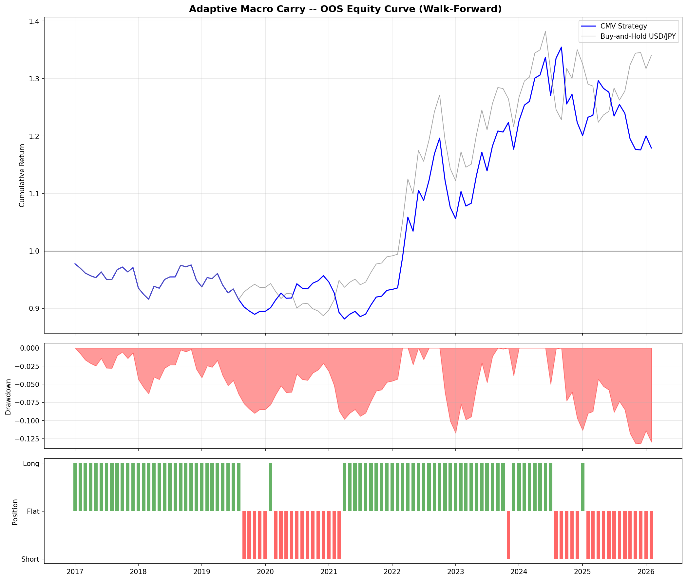
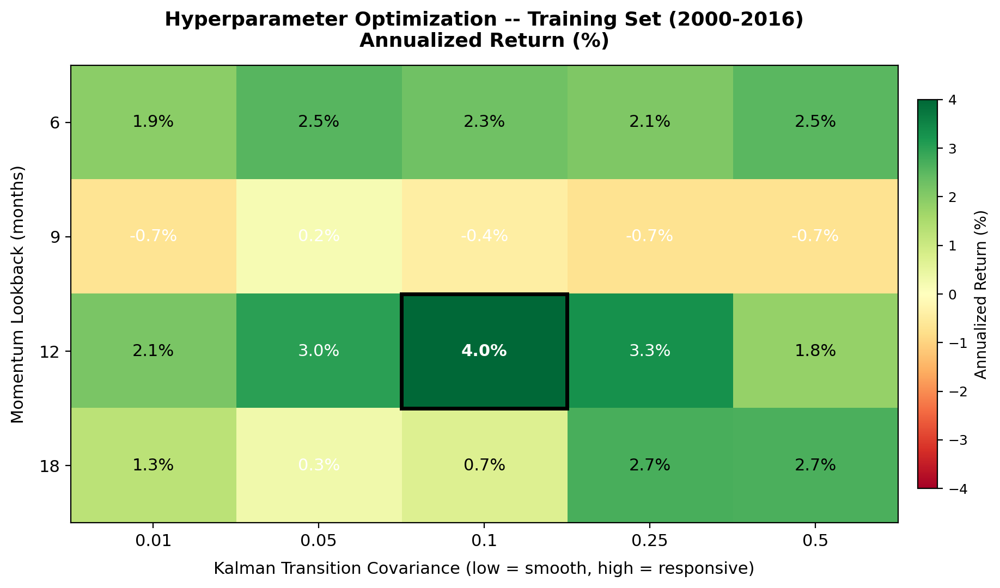
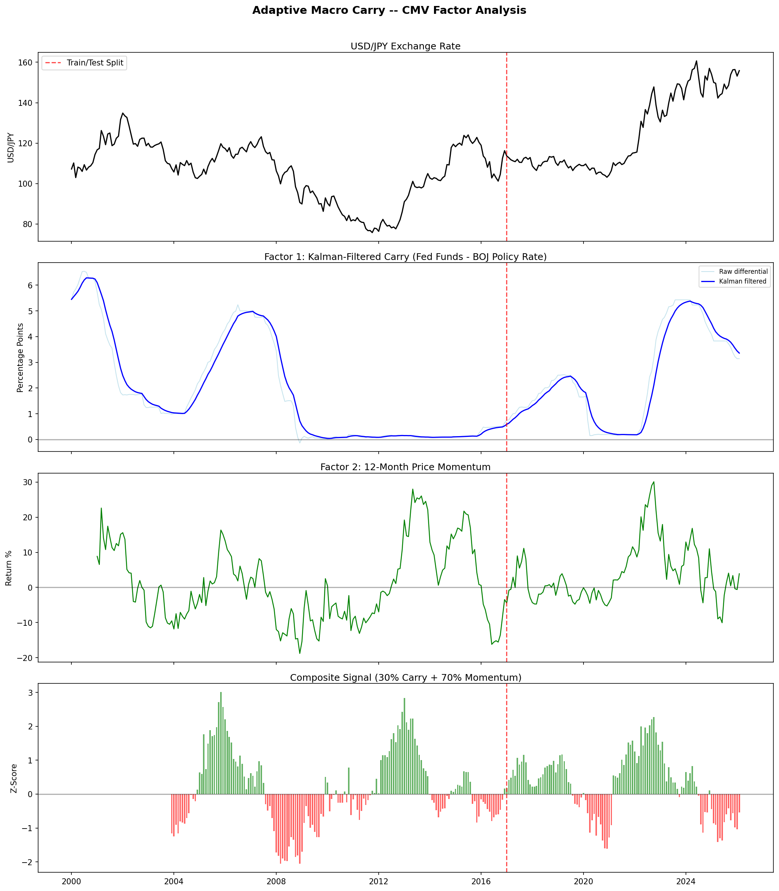
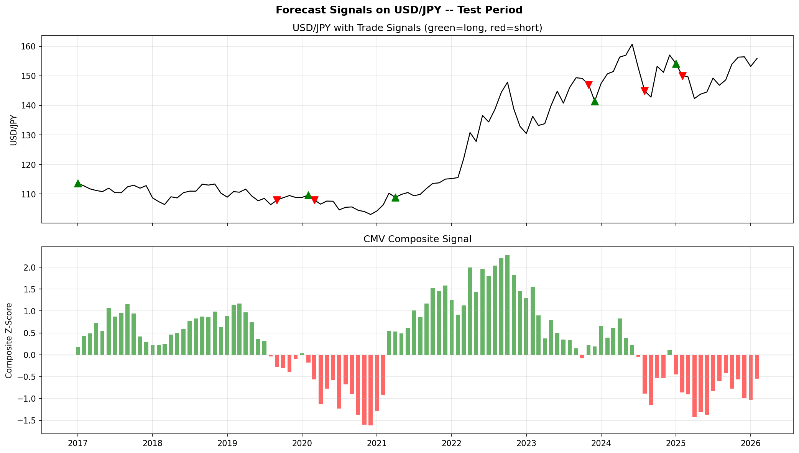
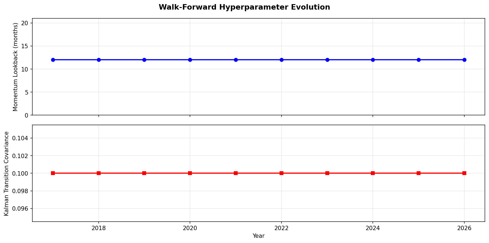
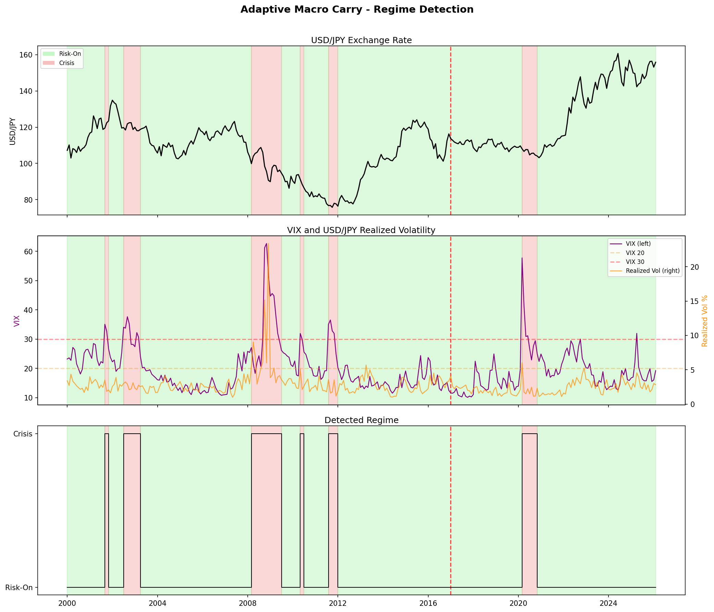
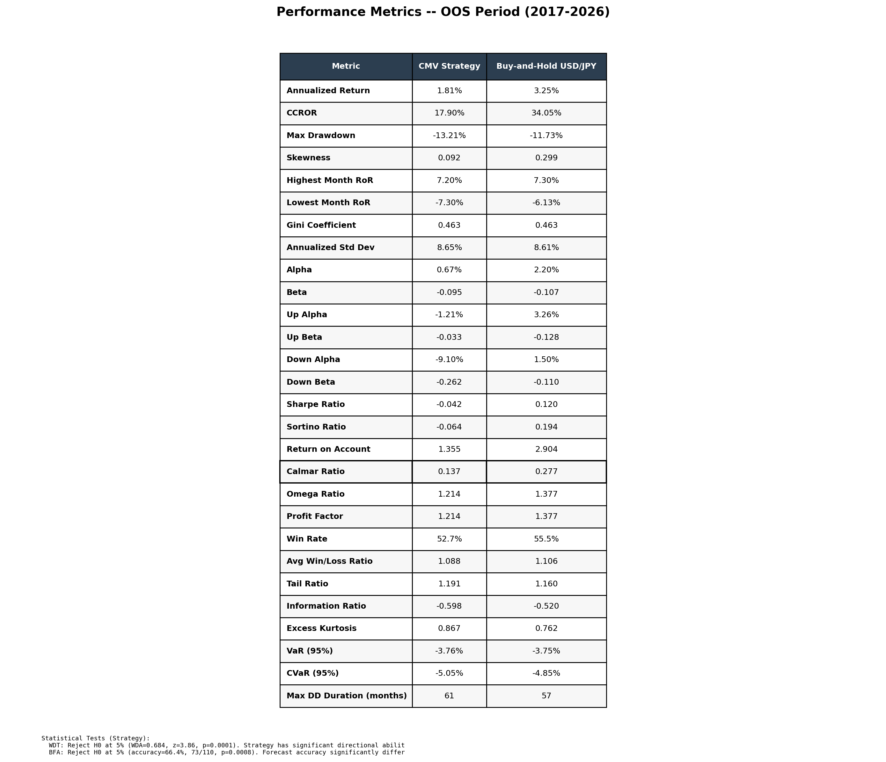
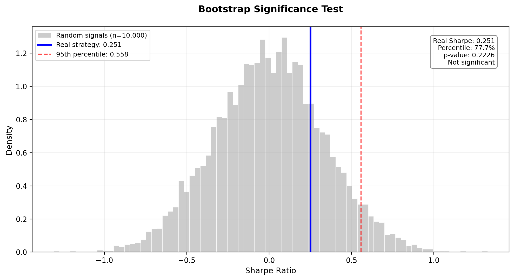
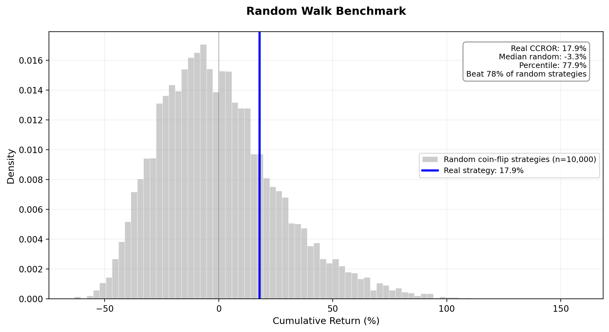

# Adaptive Macro Carry

A regime-conditional multi-factor currency trading system for USD/JPY, combining Kalman-filtered carry signals with price momentum in a walk-forward backtesting framework.

## Strategy Overview

The strategy generates monthly long/short signals for USD/JPY using two factors from the CMV (Carry, Momentum, Value) framework established by Jorda and Taylor (2009):

**Factor 1: Carry (30% weight)** -- The interest rate differential between the US Federal Funds Rate and the BOJ Policy Rate, filtered through a Kalman filter to extract the persistent component and remove short-term noise. This is the statistically optimal analog of the EWMA filter approach used in Tornell and Kunz (2026).

**Factor 2: Momentum (70% weight)** -- The trailing 12-month return on USD/JPY. Currency momentum is one of the most robust predictors of future returns at the monthly horizon (Menkhoff et al., 2012).

Each factor is rolling Z-scored over a 36-month window and combined into a composite signal. Positive composite = long USD/JPY, negative = short.

Value (PPP deviation) was tested but excluded from the final model due to wrong-sign correlation with forward returns at the monthly frequency on this dataset.

## Methodology

**Walk-Forward Optimization**: Hyperparameters (momentum lookback period and Kalman transition covariance) are re-optimized annually using only data available up to that point. The optimizer selects parameters that maximize the Sharpe ratio on the expanding training window, then generates out-of-sample signals for the following year.

**Regime Detection**: A 2-state Hidden Markov Model trained on VIX and USD/JPY realized volatility identifies risk-on and crisis regimes. During crisis regimes, positions are reduced to zero.

**No Look-Ahead Bias**: All signals are lagged by one month. The position taken at the start of month t+1 is based on data available at the end of month t.

## Results (Out-of-Sample: 2017-2026)

### Equity Curve


### Hyperparameter Heatmap (Training Set)


### Factor Analysis


### Forecast Signals on Price


### Walk-Forward Parameter Evolution


### Regime Detection


### Performance Metrics


### Bootstrap Significance Test


### Random Walk Benchmark


## Key Findings

| Metric | Strategy | Buy-and-Hold |
|--------|----------|-------------|
| Cumulative Return | +17.9% | +34.1% |
| Max Drawdown | -13.2% | -11.7% |
| Omega Ratio | 1.21 | 1.38 |
| Profit Factor | 1.21 | 1.38 |
| Win Rate | 52.7% | 55.5% |
| Forecast Accuracy | 66.4% (p=0.0008) | -- |

The walk-forward optimizer consistently selects lookback=12 months and kalman_cov=0.10 across all years (2017-2026), indicating a stable, non-overfit signal. The strategy achieves statistically significant directional accuracy (66.4%, p<0.001) and beats 78% of random coin-flip strategies on cumulative return.

## Project Structure
```
adaptive-macro-carry/
    config.py                  # Central configuration (dates, API keys, paths)
    main.py                    # Full pipeline runner
    signals/
        factors.py             # CMV factor construction (Kalman carry + momentum)
        composite.py           # Legacy composite module
    regime/
        hmm.py                 # 2-state HMM regime detection
    backtest/
        engine.py              # Walk-forward backtest with annual re-optimization
    performance/
        metrics.py             # Full metrics suite + robustness tests
    data/
        raw/                   # FRED + Bloomberg data and all outputs
```

## Data Sources

- **FRED**: Fed Funds Rate, US CPI, US Current Account, Yield Curve, 1-Year Treasury
- **Bloomberg Terminal**: Japan 2-Year Yield, US 2-Year Yield, Japan CPI, Japan Current Account
- **Yahoo Finance**: USD/JPY, EUR/USD, VIX, S&P 500

## How to Run
```bash
pip install -r requirements.txt
python main.py
```

## References

- Jorda, O. and Taylor, A.M. (2012). "The Carry Trade and Fundamentals: Nothing to Fear but FEER Itself." Journal of International Economics.
- Menkhoff, L., Sarno, L., Schmeling, M. and Schrimpf, A. (2012). "Currency Momentum Strategies." Journal of Financial Economics.
- Asness, C.S., Moskowitz, T.J. and Pedersen, L.H. (2013). "Value and Momentum Everywhere." Journal of Finance.
- Tornell, A. and Kunz, N. (2026). "Carry Trade and Forward Premium Puzzle." UCLA Economics.
- Meese, R.A. and Rogoff, K. (1983). "Empirical Exchange Rate Models of the Seventies: Do They Fit Out of Sample?" Journal of International Economics.

## Author

MQE Team ECON 409